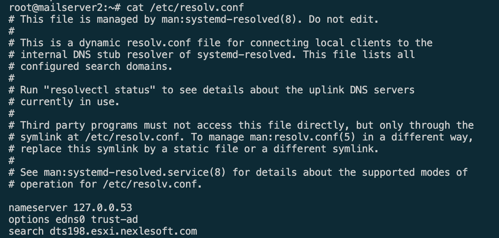

# Build Redmine 8.8 on Ubuntu 20.04

Link download zimbra:

- [https://files.zimbra.com/downloads/10.0.0_GA/zcs-NETWORK-10.0.0_GA_4518.UBUNTU20_64.20230301065514.tgz](https://)

## Step 1: Chuẩn bị resouce trên vps cài đặt

Clone resouce này về local

```
git clone https://github.com/anhit-workspace/build-zimbra-docker.git
```

Resouce cài đặt Zimbra đã có sẵn khi build image, zimbra resouce: `/home/zimbra`
Nếu khi build lên chưa có sẵn resource thì hãy truy cập vào container và tải nó vs lệnh

```

wget https://files.zimbra.com/downloads/8.8.15_GA/zcs-8.8.15_GA_4179.UBUNTU20_64.20211118033954.tgz
```

Sau khi clone git repo về hãy build Dockerfile


```
cd build-zimbra-docker && \
docker build -t anhit:zcsub2004 .
```

## Step 2: Run Image and map volume zimbra data

```
docker run -dit --name zcs -h mail.domain.com -p 25:25 -p 80:80 -p 443:443 -p 465:465 -p 587:587 -p 993:993 -p 995:995 -p 7071:7071 -v $(pwd)/zimbra:/opt/zimbra anhit:zcsub2004
```

## Step 3: Recheck config container

- Để truy cập vào container này ta có thể dùng lệnh

```
docker exec -it zcs bash
```

- Check status dns
  docker exec -it zcs sh -c "/etc/init.d/named status"
- Check config resolv.conf

```
docker exec -it zcs sh -c "cat /etc/resolv.conf"
```




docker exec -it zcs sh -c "cat /etc/hosts"

- Check status rsyslog

```
docker exec -it zcs sh -c "/etc/init.d/rsyslog status"
```

Ngoài ra còn một số lệnh thao tác vs DNS khác

```
# nslookup check MX record
nslookup -type=MX nexlesoft.io.vn

# Trường hợp đã setup or cài lại thì nên clean cache để đảm bảo quá trình cài đặt config mới được nhận.
systemd-resolve --flush-caches
```

## Step 4: Nếu check các config đã OK thì run setup DNS auto

```
docker exec -it zcs sh -c "/srv/dns-auto.sh"
```

## Step 5: Bắt đầu chính thức Intall Zimbras

Run lệnh dưới để cài đặt

```
docker exec -it zcs sh -c "cd /home/zimbra/ && ./install.sh"
```

or

```
docker exec -it zcs sh -c "cd /home/zimbra/ && ./install.sh --platform-override"
```

## Một số lệnh làm việc với zimbra
Link bài viết tham khảo thêm: https://www.ssldragon.com/how-to/install-ssl-certificate/zimbra/
Từ container, cần chuyển sang user zimbra:
```
su - zimbra
```
Xem tình trạng zimbra
```
zmcontrol status
```
Restart Zimbra
```
zmcontrol restart
```
Check version setup
```
zmcontrol -v
```


## Một số setup xác thực của Zimbra

### DKIM
Link hướng dẫn tham khảo: https://wiki.zimbra.com/wiki/Configuring_for_DKIM_Signing
Use user zimbra
```
su zimbra
```
Add DKIM data to a domain with no existing DKIM configuration
 ```
 /opt/zimbra/libexec/zmdkimkeyutil -a -d example.com
 ```
## Link lib

- Link zimbra sử dụng: https://files.zimbra.com/downloads/8.8.15_GA/zcs-8.8.15_GA_4179.UBUNTU20_64.20211118033954.tgz
- Link zimbra latest version: https://files.zimbra.com/downloads/10.0.0_GA/zcs-NETWORK-10.0.0_GA_4518.UBUNTU20_64.20230301065514.tgz
