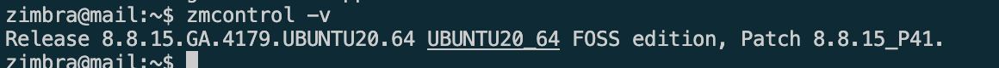

# Build Redmine 8.8 on Ubuntu 20.04

Link download zimbra:

- [https://files.zimbra.com/downloads/10.0.0_GA/zcs-NETWORK-10.0.0_GA_4518.UBUNTU20_64.20230301065514.tgz](https://)
- Yêu câu tối thiểu

  CPU – 1.5 Ghz
  Memory – 8 GB
  Storage – 5 GB for ZCS installation

### Step 1: Chuẩn bị resouce trên vps cài đặt

Clone resouce này về local

```
git clone -b ubuntu/20.04 https://github.com/anhit-workspace/build-zimbra-docker.git
```

Resouce cài đặt Zimbra đã có sẵn khi build image, zimbra resouce: `/home/zimbra`
Nếu khi build lên chưa có sẵn resource thì hãy truy cập vào container và tải nó vs lệnh

```

wget https://files.zimbra.com/downloads/8.8.15_GA/zcs-8.8.15_GA_4179.UBUNTU20_64.20211118033954.tgz
```

Sau khi clone git repo về hãy build Dockerfile

```
cd build-zimbra-docker && \
docker build -t anhit:zcsub2004 .
```

### Step 2: Run Image and map volume zimbra data

```
docker run -dit --name zcs -h mail.nexle.local -p 25:25 -p 80:80 -p 443:443 -p 465:465 -p 587:587 -p 993:993 -p 995:995 -p 7071:7071 -v $(pwd)/zimbra:/opt/zimbra anhit:zcsub2004
```

### Step 3: Recheck config container

Sau khi run container, cần check lại một số thông số cơ bản trước khi setup zimbra
Để truy cập vào container này ta có thể dùng lệnh

```
docker exec -it zcs bash
```

* Check hosts file config
  `docker exec -it zcs sh -c "cat /etc/hosts"`
  File config cần thông tin cơ bản sau

  ```
  127.0.0.1       localhost
  172.17.0.3      mail.nexle.local mail
  #Trong đó 172.17.0.3 là ip local của vps sẽ cài đặt email server, trường hợp này là ip local của container hiện tại
  ```
* Check resolv config:
  `docker exec -it zcs sh -c "cat /etc/resolv.conf"`

  ```
  # Generated by NetworkManager
  search domain.local
  nameserver 172.17.0.3 
  nameserver 8.8.8.8
  nameserver 8.8.4.4
  ```
* Check hostname:
  `exec -it zcs sh -c "hostname"`
  Nếu hiển thị như dưới là được:

  ```
  mail.domain.local
  ```
* Check dns-auto.sh file có tồn tại không:
  `docker exec -it zcs sh -c "find /srv/dns-auto.sh"`
  Nếu file dn-auto tồn tại thì run file `dns-auto.sh` để auto config domain này.
  `docker exec -it zcs sh -c "/srv/dns-auto.sh"`
* Check các services cần thiết có được cài không:

  ```
   #Bind9 service
   docker exec -it zcs sh -c "/etc/init.d/named status"

   #rsyslog service
   docker exec -it zcs sh -c "/etc/init.d/rsyslog status"
  ```
* Check lại config DNS sau khi run dns-auto.sh

  ```
  docker exec -it zcs sh -c "dig MX domain.local"
  docker exec -it zcs sh -c "dig A mail.domain.local"
  ```

  hoặc có thể sử dụng lệnh:

  ```
  docker exec -it zcs sh -c "nslookup -type=A mail.domain.local"
  docker exec -it zcs sh -c "nslookup -type=MX domain.local"
  ```
* Trường hợp đã setup or cài lại thì nên clean cache để đảm bảo quá trình cài đặt config mới được nhận.
  `systemd-resolve --flush-caches`
* Nếu đã run dns-auto.sh có thể check config bằng cách
  `docker exec -it zcs sh -c "cat /etc/bind/db.domain.local"`
  P/S: Nếu chưa config dns xong thì không run được file này

### Step 3: Intall Zimbra

Run lệnh dưới để cài đặt

```
docker exec -it zcs sh -c "cd /home/zimbra/ && ./install.sh"
```

Tuy nhiên có một số trường hợp có thể do version OS của bạn có chút không phù hợp dẫn đến một số lỗi do thiếu hoặc không đúng platform thì có thể dùng lệnh

```
docker exec -it zcs sh -c "cd /home/zimbra/ && ./install.sh --platform-override"
#Tuy nhiên tôi không khuyến khích bạn dùng lệnh này. Nó chỉ nên sử dụng cho việc test or demo tạm thời, nếu build production bạn vẫn nên giải quyết triệt để vấn đề trước khi install zimbra
```

## Một số lệnh làm việc với zimbra

Link bài viết tham khảo thêm: https://www.ssldragon.com/how-to/install-ssl-certificate/zimbra/

Để thao tác với zimbra cần chuyển sang user zimbra

```
su - zimbra
# or: su zimbra
```

- Xem tình trạng zimbra

  ```
  zmcontrol status
  ```
- Restart Zimbra

  ```
  zmcontrol restart
  ```
- Check version setup

  ```
  zmcontrol -v
  ```



## Việc setup Zimbra đến đây là kết thúc, tuy nhiên để có 1 zimbra server tốt hơn bạn có thể tìm hiểu config DKIM và certbot

- Tham khảo config DKIM

  Link: https://wiki.zimbra.com/wiki/Configuring_for_DKIM_Signing

  Use user zimbra

  ```
  su zimbra
  ```
  Add DKIM data to a domain with no existing DKIM configuration

  ```
  /opt/zimbra/libexec/zmdkimkeyutil -a -d domain.local
  ```
- Một số link tải zimbra hoặc tham khảo khác:

  - Link zimbra đang sử dụng: https://files.zimbra.com/downloads/8.8.15_GA/zcs-8.8.15_GA_4179.UBUNTU20_64.20211118033954.tgz
  - Link zimbra latest version: https://files.zimbra.com/downloads/10.0.0_GA/zcs-NETWORK-10.0.0_GA_4518.UBUNTU20_64.20230301065514.tgz
- Documents Zimbra: [Link](http://docs.zimbra.com/docs/shared/8.6.0/system_requirements/wwhelp/wwhimpl/js/html/wwhelp.htm#href=System_Requirements_86.System_Requirements_for_Zimbra_Collaboration.html)
- Link hướng dẫn setup trên vps: [Install Zimbra 8.8 on Ubuntu 20.04|18.04|16.04](https://computingforgeeks.com/how-to-install-zimbra-collaboration-on-ubuntu/)
- Hướng dẫn từ inguide:

  - https://inguide.in/install-zimbra-mail-server-on-centos-step-by-step/
  - https://inguide.in/install-zimbra-on-ubuntu-20-04-step-by-step/
- Link tham khảo gốc ban đầu của imanudin: [Link](https://imanudin.net/2019/11/16/how-to-install-zimbra-on-docker-container/)
